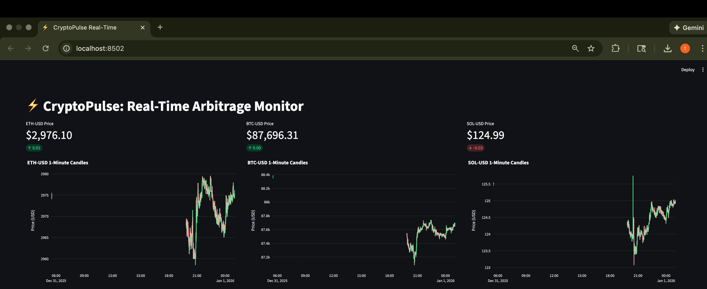
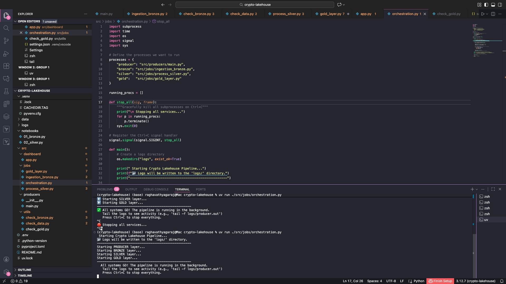
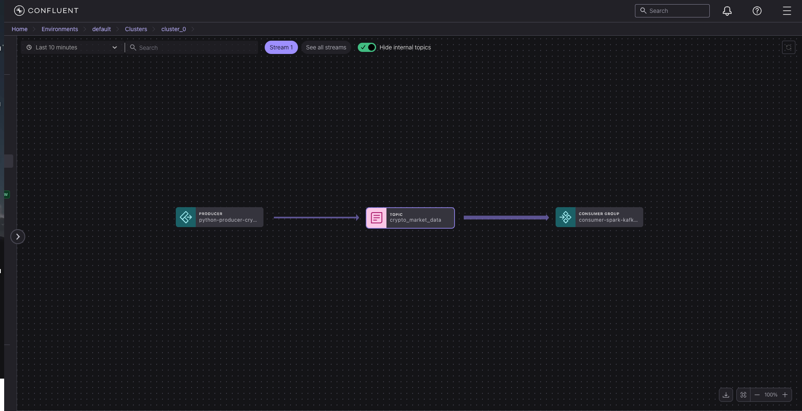

# CryptoPulse
## Real-Time Cryptocurrency Arbitrage Detection Lakehouse

**CryptoPulse** is a real-time data engineering project built using **Kappa Architecture** and **Lakehouse design principles**. It ingests live cryptocurrency trade data, guarantees durability with Kafka, and processes streams with Spark Structured Streaming to detect arbitrage opportunities while maintaining high-quality historical data for analytics and backtesting.

--
## 📚 Table of Contents


[Problem Statement](#-Problem-Statement)

[Solution Overview](#-Solution-Overview)

[Architecture Diagram](#-Architecture-Diagram)

[Project Structure](#-Project-Structure)

[Pipeline Layers](#-Pipeline-Layers)

[Ingestion Layer Producers](#-Ingestion-Layer-Producers)

[Bronze Layer — Raw Data](#-Bronze-Layer—Raw-Data)

[Silver Layer — Cleaned Data](#-Silver-Layer—Cleaned-Data)

Gold Layer — Aggregated Metrics

Core Data Flow Diagram

Tech Stack

Key Engineering Decisions

Why Delta Lake?

Why Local Spark Instead of Databricks Community Edition?

Schema Evolution Strategy

Features

Setup & Installation

Demo

---

## 📌 Problem Statement

Cryptocurrency markets are highly fragmented. The same asset frequently trades at different prices across exchanges due to liquidity differences, latency, and market inefficiencies.

Detecting arbitrage opportunities is challenging because:
- Data volume is extremely high
- Exchange APIs are unstable and disconnect frequently
- Events arrive out of order due to network latency
- Streaming systems must guarantee zero data loss

---

## 💡 Solution Overview

CryptoPulse decouples ingestion from processing using **Apache Kafka** and processes data using **Spark Structured Streaming** backed by **Delta Lake**. This design ensures:

- Fault-tolerant ingestion
- Exactly-once processing semantics
- Correct handling of late-arriving data
- Replayable raw data for reprocessing and schema evolution

---

## 🏗 Architecture Diagram
<p align="center">
  
</p>

---
## 📁 Project Structure

```text
.crypto-pulse/
├── data/                         # Local Data Lake
│   ├── delta/                    # ACID Tables (Bronze / Silver / Gold)
│   └── checkpoints/              # Spark Streaming Checkpoints
├── logs/                         # Runtime logs
├── images/                       # Architecture & Pipeline Screenshots
│   ├── architecture_crypto.png
│   ├── dataflow_diagram_crypto.png
│   ├── kafka_confluent_topic_lineage.png
│   ├── kafka_messages.png
│   ├── gold_layer_data.png
│   ├── live_dashboard.png
│   └── orchestrator_screenshot.png
├── src/
│   ├── dashboard/
│   │   └── app.py                # Streamlit Visualization
│   ├── jobs/
│   │   ├── ingestion_bronze.py   # Kafka → Bronze (Delta)
│   │   ├── process_silver.py     # Bronze → Silver (Cleaning)
│   │   ├── gold_layer.py         # Silver → Gold (Aggregation)
│   │   └── orchestrator.py       # Pipeline Orchestration
│   ├── producers/
│   │   └── main.py               # WebSocket → Kafka Producer
│   ├── utils/
│   │   ├── check_bronze.py
│   │   └── check_gold.py
│   └── __init__.py
├── .env                          # Secrets (Git ignored)
├── pyproject.toml
└── README.md
```

The pipeline follows a **Lakehouse Medallion Architecture**.

---

## 🔹 Pipeline Layers

### 1. Ingestion Layer Producers
- **Source:** Coinbase & Binance WebSocket APIs
- **Language:** Python
- **Transport:** Apache Kafka (Confluent Cloud)

Kafka provides a durable buffer between volatile APIs and Spark, ensuring no data loss if downstream systems fail.

---

### 2. Bronze Layer — Raw Data
- **Storage:** Delta Lake
- **Write Mode:** Append-only
- **Schema:** Raw JSON (`CAST(value AS STRING)`)

**Why this matters**
- Enables full stream replay
- Protects against API schema changes
- Decouples ingestion from parsing logic

---

### 3. Silver Layer — Cleaned Data
- JSON parsing and schema enforcement
- Deduplication
- Type casting

**Financial Precision**
Prices are stored as `Decimal(18,8)` instead of floating-point doubles to avoid rounding errors common in financial calculations.

---

### 4. Gold Layer — Aggregated Metrics
- 1-minute OHLC candles
- VWAP (Volume Weighted Average Price)
- Windowing: 1 minute
- Watermarking: 10 seconds

Late-arriving events are correctly assigned to their original window before aggregation is finalized.

---
## 🧩 Core Data Flow Diagram 
<p align="center">
  
</p>

## 🛠 Tech Stack

### Core Technologies
- **Language:** Python 3.12
- **Streaming Engine:** Apache Spark 3.5.3
- **Message Broker:** Apache Kafka (Confluent Cloud)
- **Storage Format:** Delta Lake 3.3.0
- **Architecture:** Kappa + Lakehouse

### Key Libraries
- `pyspark`
- `delta-spark`
- `confluent-kafka`
- `uv`

---

## 🧠 Key Engineering Decisions

### Why Delta Lake?
Traditional Parquet streaming pipelines often suffer from:
- Small file problems
- Concurrent read/write conflicts
- Downstream corruption

Delta Lake introduces a transaction log (`_delta_log`) that provides:
- ACID guarantees
- Safe concurrent reads and writes
- Reliable downstream consumption

---

### Why Local Spark Instead of Databricks Community Edition?
Databricks Community Edition:
- Blocks outbound Kafka connections
- Imposes execution limits

Running Spark locally allows:
- Full JVM control
- Unlimited execution time
- Use of the same Delta Lake APIs used in production environments

---

### Schema Evolution Strategy
By storing raw JSON in the Bronze layer:
- Schema changes do not break the pipeline
- Parsing logic can evolve independently
- Historical data can be reprocessed safely

---

## 🚀 Features

- Fault-tolerant ingestion with Kafka buffering
- ACID-compliant streaming analytics
- Stateful processing with watermarking and windowing
- Replayable raw data
- Financial-grade numeric precision
- Modern Python dependency management with `uv`

---

## 💻 Setup & Installation

### Prerequisites
- Python 3.10+
- Java 17 (required for Spark)
- Confluent Cloud account (free tier)
- `uv` package manager

```bash
pip install uv
```

📸 Demo
Real-Time Dashboard
Here is the live Streamlit dashboard visualizing the 1-minute OHLC candles from the Gold layer.
<p align="center">
  
</p>

Pipeline Orchestration
The custom Python orchestrator managing 4 concurrent Spark jobs. !
<p align="center">
  
</p>

Kafka Confluent Data Lineage Graph
<p align="center">
  
</p> 


